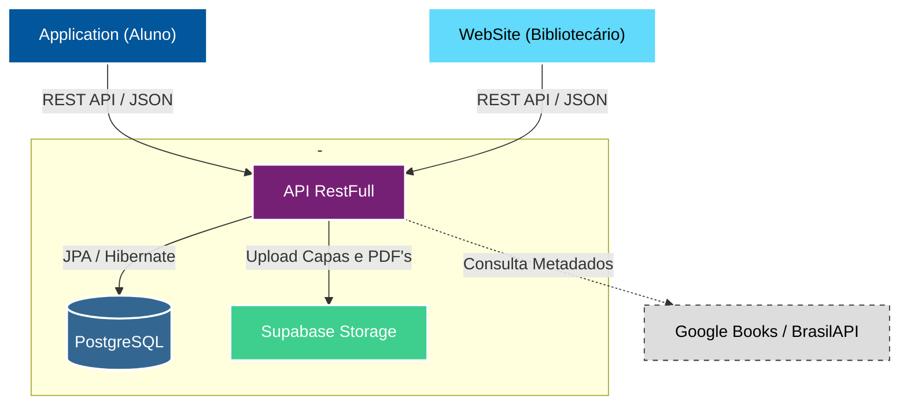

  <!-- Banner -->
  

  <!-- Pins-->
  
  
  

 

  <h1>Sobre o Projeto</h1>

O **LumiLivre** é um ecossistema completo desenvolvido para modernizar a administração de bibliotecas escolares e incentivar a leitura. Centralizamos processos manuais em uma plataforma unificada, conectando bibliotecários e estudantes de forma eficiente.

- **WebSite**: Painel de controle para bibliotecários gerenciarem acervo, alunos e empréstimos. 
- **Application**: Vitrine digital para alunos consultarem o catálogo e reservarem livros. 
- **API RestFull**: Cérebro da aplicação. Gerencia regras de negócio, segurança e dados.

 

  <h1>Arquitetura do Sistema</h1>

Utilizamos uma arquitetura cliente-servidor moderna baseada em microsserviços e nuvem para garantir escalabilidade.

  LumiLivre © 2025 - Todos os direitos reservados.

